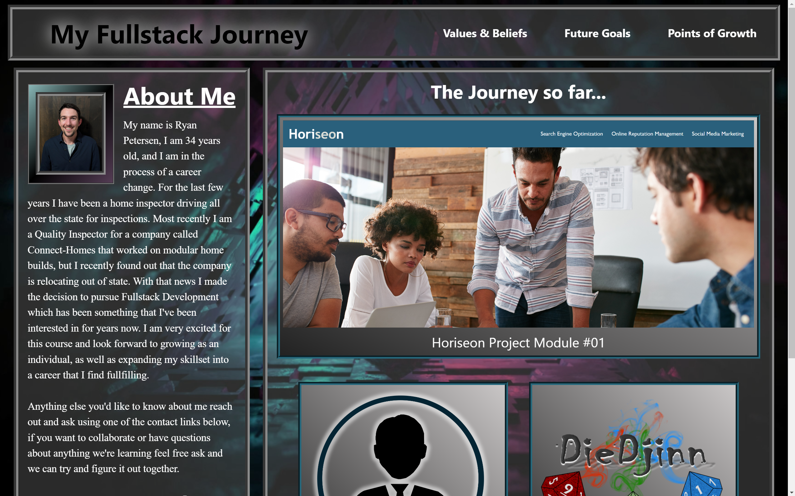

# Bio_project_module-02

## Table of Contents

- [About](#about)
- [The Purpose][def2]
    - [The Goal][def3]
- [The Process][def4]
- [The Outcome][def5]

## About 

This is the **Module 02 Challenge Project** for the **Fullstack Development BootCamp** course I am attending at UCI.
This is our second Challenge for the course. Below I'll go into more detail about what the challenge was and what it took in order for me to complete the challenge,
where I think I did well, and the places I thought I could improve further.

## The Purpose 
### Below is a partial screenshot of what the website started off as based on the starter code we were give.
 

 

### *The Goal* 

The goal of this project was to create a web page portfolio using everything that we've learned thus far in the course. The page was supposed to include projects that we've worked on, an ABOUT ME section, as well as contact links.

## The Process 

1. **Starting Off** (*Getting the ideas down into a layout.*)
    - I've already been working on various projects taht all similarly align with the idea of this pproject so half the work was done. the only thing I needed to do was update the work I had already done to include some of the more advanced css stuff that we've been working on.
2. **Updating The Layout** (*Using the new layout methods.*)
    - As I began to trying to incorporate ***Flex-box*** and ***Flex-grid*** methodologies into the projects I already had, I ran into quite a big snag for a few days. It took me nearly a week to figure out the issues I was having before I got comfortable with the concepts to move forward so I'm racing time trying to get this README done at the moment.
    - After I Figured out the ***Flex-box*** and ***Flex-grid*** I ended up deciding to start over from scratch as to reinforce the ideas that I had just figured out.
    - I think I'm actually pretty happy with how the new finished product turned out.
3. **The Big Hiccup**
    - So along the way as I was finishing up this project, I accidentaly deleted my Microsoft OneDrive Desktop which I found out also deletes all of the desktops associated with that cloud service. **FML** but I learned two very valuable lessons from this hiccup that I had.
      - Save and backup your projects often.
        - Luckily I was able to recover some of my desktop items after the deletion, including the most recent version of my project.
      - Don't even think about connecting your computer to OneDrive, there's no reason that you should be able to delete the desktops of multiple computers by accident.

## The Outcome 
I feel very happy with the final outcome of this project, I feel like there is still room for improvement though. Namely with this project...
  - Being behind in time and playing catch-up left me with not enough time to properly go through my final product and get rid of the unnecessary code in the **@mediaquery** sections of my page.
  - Efficient use of Semantic Elements and < div > as well as simplifying and condensing my CSS sheet. **(All due to time restraints)**

### Pros
- I learned and reinforced a lot of the ideas we learned the first week as well as a lot of the ideas I had already taught myself in the month prior to this course.
- I was sufficiently challenged in many aspects of this process.
    - I enjoyed working with the new flex-box and flex-grid ideas we learned in week two.
    - I was challenged when it came to debugging my CSS @media Query section.
      - I had an issue with an extra **}** that was closing the section before the rest of my code was applied.
- Reinforcing the idea of a good README file is also always enjoyable, especially since I'm actually pretty bad at expressing myself so it's good practice.
     
### Cons
- I was very stressed with the time restraints I had due to a lack of understanding of how to apply some of the elements of what we learned in week two.
- ***Do NOT use OneDrive*** having to deal with the stress of trying to recover a project 24hrs in advance of when it is due is not fun at all.

### 👇 Below is the link to the finished webpage.
### <a href="https://ryanpetersen-89.github.io/Bio_project_module-02/">**`Click Here`**</a>

 
 
 

[[Return to Top]][def] 

[def]: #bio_project_module-02
[def2]: #the-purpose
[def3]: #the-goal
[def4]: #the-process
[def5]: #the-outcome